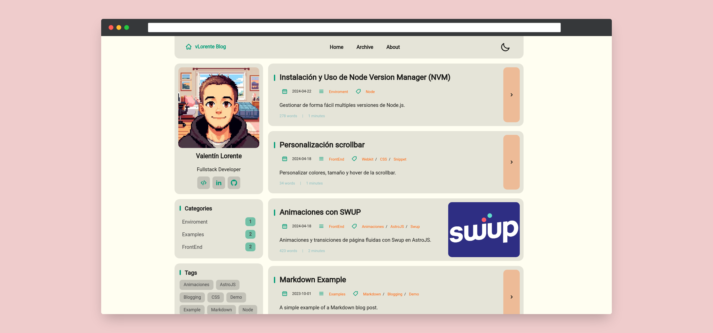

<div align="center">
<h2>
    vLorente Blog 🚀
</h2>

</div>

<p>Este es mi blog personal, donde podrás encontrar curiosidades sobre las últimas tecnologías con las que estoy experimentando, tutoriales y pequeños snippets para funcionalidades curiosas o útiles.</p>

<div align="center">


</div>

</img>

## Stack Tecnológico 🛠️

- [**Astro**](https://astro.build/): Un marco moderno y rápido para la construcción de sitios web estáticos y dinámicos.
- [**TailwindCSS**](https://tailwindcss.com/): Un marco de diseño CSS de utilidad de bajo nivel.
- [**Typescript**](https://vitest.dev/): JavaScript con sintaxis de tipado.
- [**GitHub Actions**](https://github.com/features/actions): Un servicio de CI/CD proporcionado por GitHub para automatizar tareas como pruebas, construcción y despliegue.
- [**SWUP**](https://swup.js.org/): Swup es una biblioteca versátil y extensible de transición de páginas para sitios web renderizados en el servidor.

## ⚙️ Frontmatter de los Posts

```yaml
---
draft: false
title: My First Blog Post
published: 2023-09-09
description: This is the first post of my new Astro blog.
cover: /images/cover.jpg
tags: [Foo, Bar]
category: FrontEnd
---
```

## Licencia 📝

Este proyecto está bajo la [Licencia MIT](LICENSE.txt).
