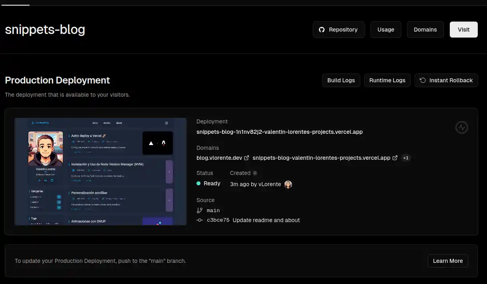
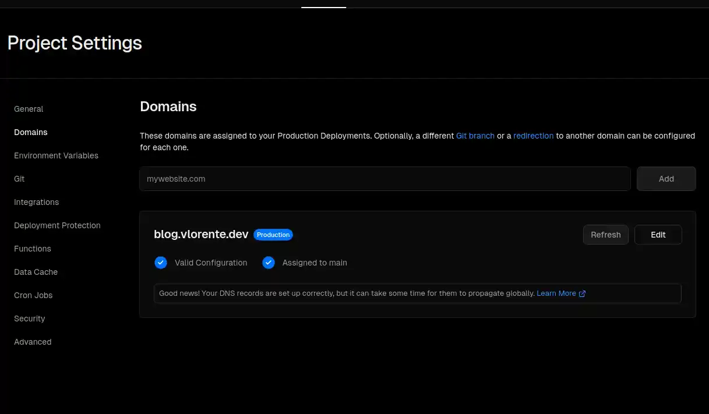

## Instalación

Astro dispone de una [integración oficial con Vercel](https://docs.astro.build/en/guides/integrations-guide/vercel/), por lo que se puede incluir mediante `astro add`.

```bash
npx astro add vercel
# or
pnpm astro add vercel
```

La ventaja de utilizar la integración oficial, es que durenta la instalación del paquete modifica automáticamente el fichero de configuración de astro para incluir la configuración de Vercel.


## Configurar Web Analytics

Paso 1: Instalar la dependencia

```bash
npm install @vercel/analytics
# or
pnpm add @vercel/analytics
```

Paso 2: Actualizar el fichero de configuración de astro `astro.config.mjs`

```javascript
import { defineConfig } from "astro/config"
import vercel from "@astrojs/vercel/serverless"

export default defineConfig({
 // ...
 adapter: vercel({
  webAnalytics: {
   enabled: true,
  },
  // ...
 }),
})
```

## Crear el proyecto en Vercel

En mi caso, tengo vinculada mi cuenta de GitHub con Vercel, por lo que puedo crear un nuevo proyecto a partir del repositorio de GitHub. Recomiendo hacerlo de esta forma, puesto que genera de forma automática los links. Además de que configura el repositorio de GitHub para que aparezca la información sobre los deploy.


Tras linkear el proyecto de vercel con el repositorio de github, se genera el primer deploy a producción, y a partir de ahora, se generá un deploy por cada commit a la rama `main`. Esta es la rama por defecto, pero se puede configurar en el proyecto de vercel.



## Configurar un nuevo Domino para tu web

Navega desde tu panel de control de vercel a tu nuevo proyecto, ya dentro del proyecto dirigete a `Settings` y en el menú lateral selecciona `Domains`.

Añade un nuevo dominio para tu web, en mi caso, `blog.vlorente.dev`. Cuando añadas el nuevo dominio, vercel detectará automáticamente las configuraciones necesarias que tendrás que realizar en tu proveedor de dominios para que este apunte a tu web de vercel. Cuando todo esté configurado correctamente aparecerá de esta forma:


