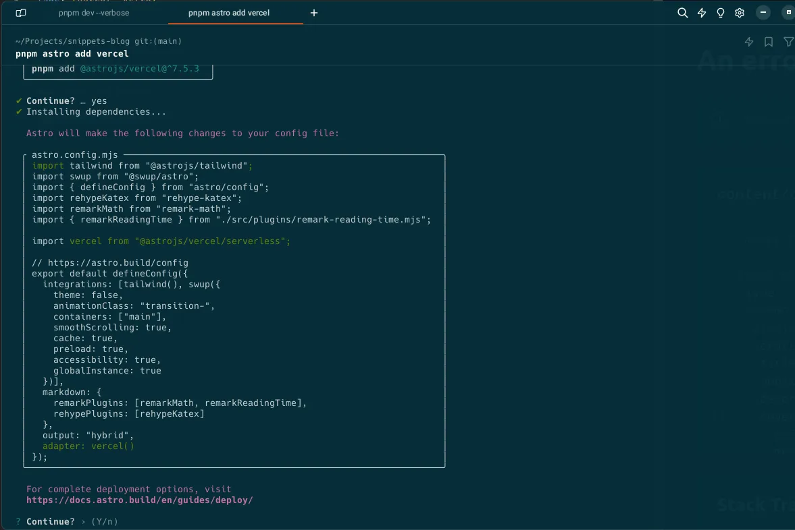
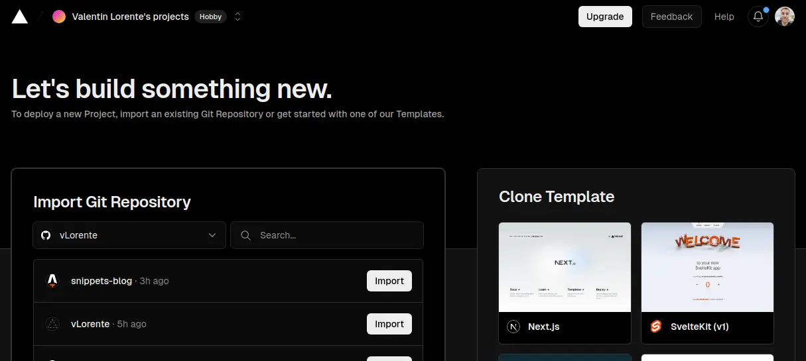

## Instalación

Astro dispone de una [integración oficial con Vercel](https://docs.astro.build/en/guides/integrations-guide/vercel/), por lo que se puede incluir mediante `astro add`.

```bash
npx astro add vercel
# or
pnpm astro add vercel
```

La ventaja de utilizar la integración oficial, es que durenta la instalación del paquete modifica automáticamente el fichero de configuración de astro para incluir la configuración de Vercel.



## Configurar Web Analytics

```javascript
import { defineConfig } from "astro/config"
import vercel from "@astrojs/vercel/serverless"

export default defineConfig({
 // ...
 output: "server",
 adapter: vercel({
  webAnalytics: {
   enabled: true,
  },
 }),
})
```

## Crear el proyecto en Vercel

En mi caso, tengo vinculada mi cuenta de GitHub con Vercel, por lo que puedo crear un nuevo proyecto a partir del repositorio de GitHub. Recomiendo hacerlo de esta forma, puesto que genera de forma automática los links. Además de que configura el repositorio de GitHub para que aparezca la información sobre los deploy.


