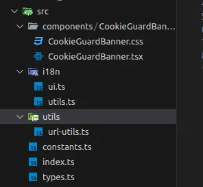
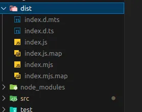

Guia de creación desde cero de un componente React y publicación del paquete en NPM.

[Proyecto completo en github](https://github.com/vLorente/react-cookie-guard)

# Crear el componente React y configurar el build

Para usar de ejemplo voy a usar [mi primer componente React publicado en NPM](https://www.npmjs.com/package/react-cookie-guard), se trata de un componente que provee del banner para el manejo del uso de cookies en una web.

Para publicar el componente en npm, voy a hacer uso de [tsup](https://tsup.egoist.dev/#what-can-it-bundle), es una herramienta de empaquetado (bundling) rápida y fácil de usar para proyectos en TypeScript y JavaScript. Es utilizada principalmente para compilar y agrupar el código de una biblioteca o aplicación en un formato que pueda ser distribuido y consumido por otros proyectos.

## Configuración de TSUP

Primero instalamos `tsup` como dependencia de desarrollo.

```bash
pnpm add -D tsup
```

Modificamos el `package.json` para indicar que el script `build` va a ejecutar `tsup`.

```json
{
 "scripts": {
  "build": "tsup src/index.ts"
 }
}
```

Crear el archivo de configuración `tsup.config.ts`.

```javascript
import { defineConfig } from "tsup"

export default defineConfig({
 minify: true,
 target: "es2018",
 external: ["react"],
 sourcemap: true,
 dts: true,
 format: ["esm", "cjs"],
 injectStyle: true,
})
```

Configurar el index.ts para que se genere el build correctamente.

`index.ts`

```javascript
// Do not write code directly here, instead use the `src` folder!
// Then, use this file to export everything you want your user to access.

export { default as CookieGuardBanner } from "./components/CookieGuardBanner/CookieGuardBanner"
export * from "./components/CookieGuardBanner/CookieGuardBanner"
export * from "./components/CookieGuardBanner/CookieGuardBanner.css"

export * from "./types"
```

`Estructura del proyecto`



### Configuración package.json

1. `exports`: se utiliza para especificar los puntos de entrada del paquete dependiendo del entorno o del método de importación que se utilice.
2. `types`: se utiliza para indicar el archivo de declaraciones de TypeScript principal de tu paquete. Esto es necesario para que TypeScript y editores de código como VSCode puedan proporcionar autocompletado y verificación de tipos cuando alguien usa tu paquete.
3. `files`: se utiliza para especificar qué archivos y directorios deben incluirse en el paquete cuando se publica en el registro de paquetes (por ejemplo, npm). Esto ayuda a controlar el tamaño del paquete y evita la inclusión de archivos innecesarios.

```json
{
 // ...
 "exports": {
  "types": "./dist/index.d.ts",
  "import": "./dist/index.mjs",
  "require": "./dist/index.js"
 },
 "types": "src/types.ts",
 "files": ["dist"]
 // ...
}
```

También se puede añadir información adicional, que complementará el paquete de npm, como por ejemplo:

```json
{
 // ...
 "keywords": ["react", "cookies", "react-component"],
 "author": {
  "name": "vLorente",
  "url": "https://github.com/vlorente"
 },
 "license": "MIT",
 "homepage": "https://cookies.vlorente.dev/",
 "repository": {
  "type": "git",
  "url": "git+https://github.com/vLorente/react-cookie-guard"
 },
 "bugs": {
  "url": "https://github.com/vLorente/react-cookie-guard/issues"
 }
 // ...
}
```

### Generar el build

```bash
pnpm run build
```



# Publicar en NPM

### Autenticar npm en el terminal

```bash
npm adduser
```

### Configuración del proyecto

Crear el fichero `.npmignore`, fichero de exclusión de npm, añadir todo aquello que no queremos que se publique.

```
# unnecesary dirs
test/
website/
.github/
src/

# dependencies
node_modules/

# environment variables
.env
.env.production

# macOS-specific files
.DS_Store

# config files
tsconfig.json
tsup.config.ts
.editorconfig
.prettierrc.msj
eslint.config.mjs
.gitignore

# lock files
package-lock.json
yarn.lock
pnpm-lock.yaml
```

También es importante, crear el fichero `README.md` y que este contenga una descripción del funcionamiento del paquete, puesto que es el que aparecerá en la web de NPM.

### Publicar el paquete en NPM

```bash
npm publish
```
