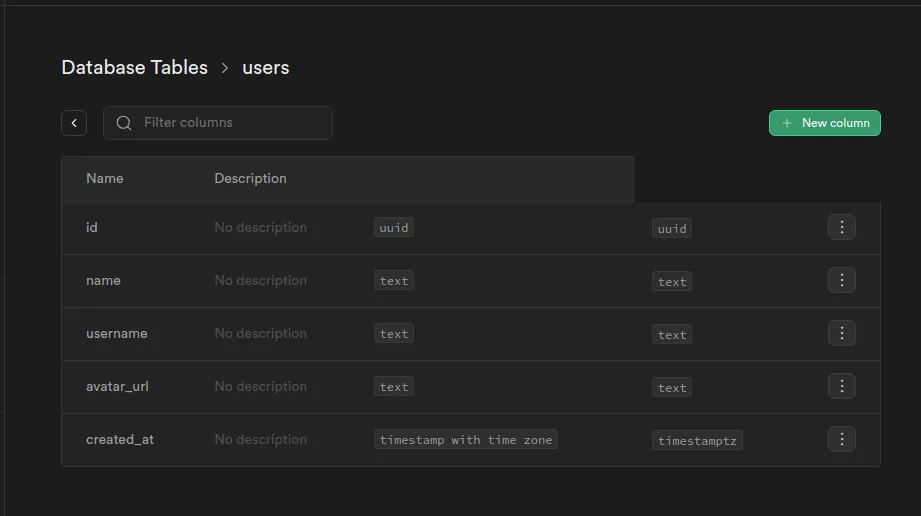

## ¿Qué es auth schema?

Primero, vamos a entender que es el schema `auth` de supabase. Se trata de un schema privado donde se almacena toda la información de los usuarios autenticados. En mi caso estoy usando la autenticación OAuth de supabase con Google y Github.

## ¿Por qué es necesario un trigger?

Puesto que la tabla de usuario de auth es privada, vamos a crear una tabla `users` en nuestro schema `public`, y la vamor a rellenar con los datos que se generen a partir de el registro de nuevas entradas en la tabla del schema `auth`, para ello necesitamos un trigger que se active con dicho evento.

## Nueva tabla pública Users



Importante, la columna `id` es una foreign key que relaciona cada registro con su registro equivalente en la tabla `auth.users`. Configurar `on delete = CASCADE` para mantener las tablas sincronizadas.


## Crear y configurar el nuevo trigger

### Importante

En recienes versiones de Supabase, ya no es posible crear trigger sobre el schema auth mediante la interfaz de Triggers.


Por lo que deberemos crear el trigger mediante código `plpgsql`.

### Paso 1: Crear la función que va a ejecutar el trigger

Función `create_user_on_signup`

```sql
begin
  insert into public.users (id, name, username, avatar_url)
  values (
    new.id,
    new.raw_user_meta_data->>'name',
    new.raw_user_meta_data->>'user_name',
    new.raw_user_meta_data->>'avatar_url'
  );
  return new;
end
```

### Paso 2: Crear el nuevo trigger sobre la tabla `auth.users`

Como comentaba anteriormente, ya no se pueden crear trigger mediante la interfaz visual directamente sobre las tablas del schema auth, por lo que vamos a crearlo manualmente desde el `SQL Editor`.


Código del trigger:

```sql
create trigger create_user_on_signup
after insert on auth.users
for each row execute function create_user_on_signup();
```

### Paso 3: Verificar que se ha creado correctamente el trigger

Por último, nos dirigimos a la interfaz visual de configuración de trigger, seleccionamos schema `auth` y debe aparece nuestro nuevo trigger.


## Fuentes

- [Managing User Data](https://supabase.com/docs/guides/auth/managing-user-data?queryGroups=language&language=js)

- [Fixed supabase trigger](https://www.youtube.com/watch?v=mcrqn77lUmM)
